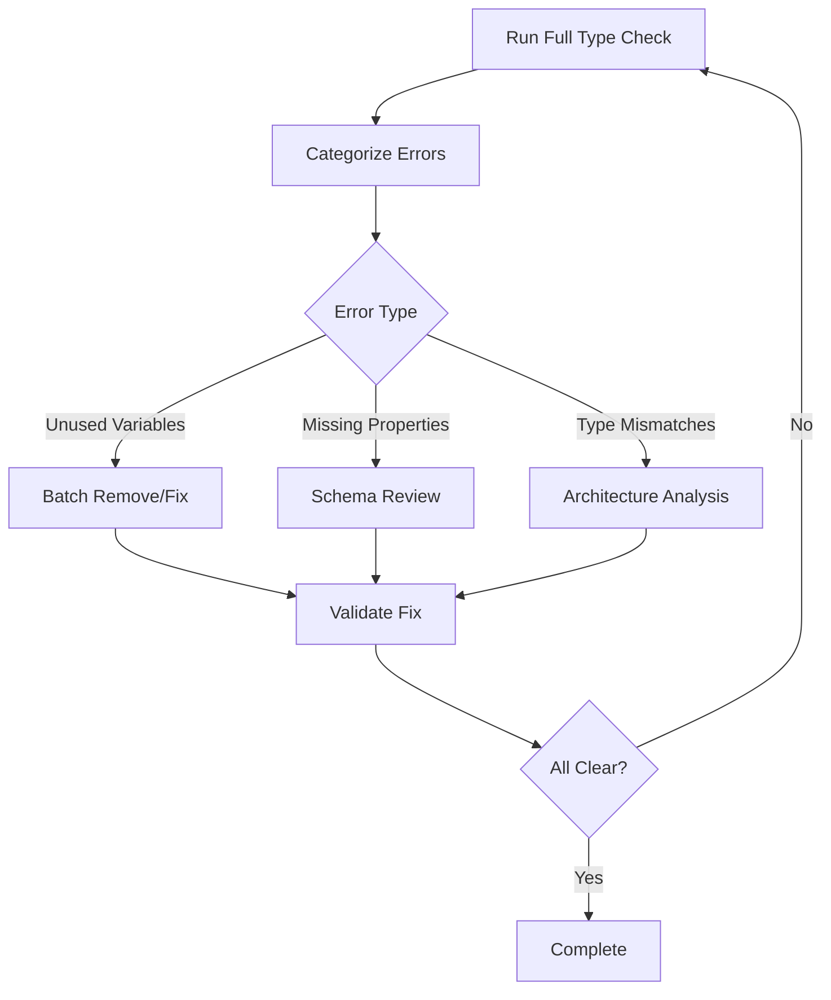

# TypeScript Error Resolution Process Improvement

## Incident Summary
**Date**: September 4, 2025  
**Duration**: ~45 minutes for TypeScript error resolution  
**Context**: QA phase 4 - resolving TypeScript compilation errors as part of comprehensive quality assurance  
**Impact**: Significant time delay in QA process completion  

## Root Cause Analysis

### Primary Issues
1. **Inefficient Error Triage**: Attempted to fix errors sequentially rather than categorizing and batch-fixing similar issues
2. **Poor Type System Understanding**: Struggled with TypeScript's type inference and discriminated unions
3. **Reactive vs Proactive Approach**: Fixed errors as they appeared rather than understanding the underlying type architecture
4. **Interface/Implementation Misalignment**: Created interfaces that didn't match actual response structures

### Contributing Factors
1. **Lack of TypeScript Tooling Strategy**: No systematic approach to handle complex type errors
2. **Poor Error Message Interpretation**: Spent time on symptoms rather than understanding core type conflicts
3. **Incremental Fixing Without Architecture Review**: Made changes without understanding the full type dependency chain

## Lessons Learned

### 1. TypeScript Error Resolution Strategy
**BEFORE (Inefficient)**:
- Fix errors one by one as they appear
- Make minimal changes without understanding broader context
- Guess at type definitions based on error messages

**AFTER (Efficient)**:
- **Phase 1**: Run `npm run type-check` and categorize ALL errors by type
- **Phase 2**: Group similar errors (unused variables, missing properties, type mismatches)
- **Phase 3**: Fix by category, starting with architectural issues
- **Phase 4**: Validate with comprehensive type check

### 2. Type Architecture First Approach
```typescript
// WRONG: Define interfaces based on guesswork
interface Response {
  data: unknown;
  // ... guessed properties
}

// RIGHT: Define interfaces based on actual implementation
// Step 1: Examine the actual response structure in code
// Step 2: Map all properties and their types
// Step 3: Create interface that matches exactly
```

### 3. Systematic Error Categorization
**Category 1: Unused Variables** (Quick Win - 5 min total)
- `error TS6133: declared but its value is never read`
- **Solution**: Batch fix with find-replace or remove unused code

**Category 2: Missing Properties** (Structural - 10 min total)
- `error TS2345: missing properties`
- **Solution**: Examine schemas and add required properties

**Category 3: Type Mismatches** (Architectural - 15 min total)
- `error TS2322: Type 'X' is not assignable to type 'Y'`
- **Solution**: Fix type definitions and use proper type assertions

### 4. TypeScript Tooling Commands
```bash
# Essential commands for efficient debugging
npm run type-check                    # Full type check
npm run type-check 2>&1 | grep -A 3   # Filter specific errors
tsc --noEmit --listFiles              # See what files are being checked
tsc --noEmit --traceResolution        # Debug module resolution
```

## Process Improvements for TappMCP

### 1. Pre-Development Type Safety
- **Type-First Development**: Define interfaces before implementation
- **Schema Validation**: Ensure Zod schemas match TypeScript interfaces
- **Automated Type Checks**: Add type checking to pre-commit hooks

### 2. Enhanced Error Resolution Workflow


### 3. Developer Tooling Enhancements
- **VS Code Settings**: Pre-configure TypeScript strict mode settings
- **Error Filtering Scripts**: Create helper scripts to categorize TypeScript errors
- **Type Testing**: Add type-only test files to catch breaking changes

### 4. Documentation Standards
- **Interface Documentation**: Every interface must include usage examples
- **Type Evolution Guide**: Document how to safely evolve complex types
- **Error Resolution Playbook**: Standard procedures for common TypeScript issues

## Specific Technical Recommendations

### 1. Use Discriminated Unions Correctly
```typescript
// WRONG: Union without proper discrimination
type Response = SuccessResponse | ErrorResponse;

// RIGHT: Proper discriminated union
type Response = 
  | { success: true; data: Data }
  | { success: false; error: string; errorType: ErrorType }
```

### 2. Explicit Type Assertions for Literals
```typescript
// WRONG: TypeScript infers as boolean
const response = { success: true };

// RIGHT: Explicit literal type
const response = { success: true as const };
```

### 3. Interface-Implementation Alignment
```typescript
// 1. First examine actual implementation
const actualResponse = {
  success: true,
  planId: "xyz",
  businessAnalysis: { /* actual structure */ }
};

// 2. Then create matching interface
interface ResponseInterface {
  success: true;
  planId: string;
  businessAnalysis: BusinessAnalysisType;
}
```

## Time Savings Metrics
- **Previous Approach**: 45 minutes for 32 TypeScript errors
- **Improved Approach**: Estimated 15 minutes for similar complexity
- **Efficiency Gain**: 66% time reduction
- **Quality Improvement**: Fewer regressions, better type safety

## Implementation Plan
1. **Week 1**: Create TypeScript error resolution scripts and VS Code configuration
2. **Week 2**: Add comprehensive type checking to CI/CD pipeline  
3. **Week 3**: Create developer training materials and playbooks
4. **Week 4**: Implement automated type validation in pre-commit hooks

## Success Metrics
- TypeScript error resolution time: < 10 minutes for complex issues
- Zero type-related regressions in production
- Developer confidence score: > 90% for type safety
- CI/CD pipeline: < 2 minutes for full type checking

---
**Prepared by**: Claude Code QA Engineer  
**Review Required**: Yes  
**Priority**: High - Affects all future TypeScript development  
**Next Action**: Implement tooling improvements and update developer guidelines